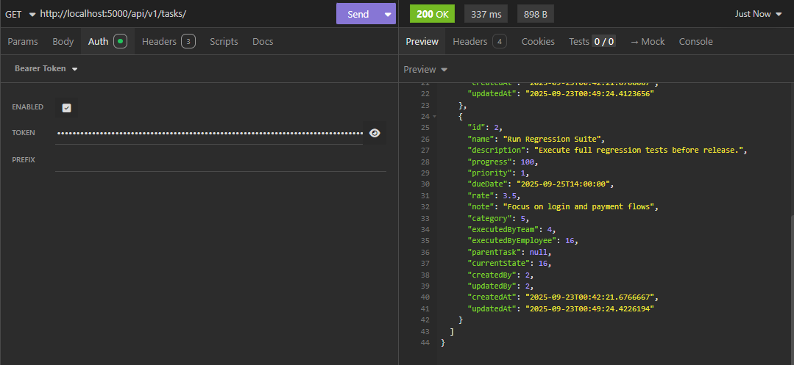

# 🧠 Task Management API

A clean, RESTful API built with ASP.NET Core and SQL Server for managing tasks, users, and authentication. Designed for backend mastery and cloud deployment readiness.


## 🚀 Tech Stack

- **Framework**: ASP.NET Core 9.0
- **Database**: Microsoft SQL Server
- **ORM**: Entity Framework Core
- **Authentication**: JWT
- **Deployment Planned**: Cloud deployment with Render and Azure SQL is in progress


## 📋 Requirements

- ✅ [.NET SDK 9.0](https://dotnet.microsoft.com/en-us/download)
- ✅ [SQL Server Management Studio (SSMS)](https://learn.microsoft.com/en-us/sql/ssms/download-sql-server-management-studio-ssms)
- ✅ Visual Studio or VS Code

## 📦 Features

- User registration & login with JWT
- Create, update, delete tasks
- Role-based access control
- Environment variable support for secure config
- Swagger UI for interactive API testing

## 🗃️ Data Model Overview

This API manages the following entities:

- **Accounts**: User login and identity
- **Roles**: Role-based access control
- **Employees & Leaders**: Organizational structure
- **Teams**: Grouping of employees
- **Tasks & TaskStates**: Task tracking and status
- **Categories**: Task classification
- **Comments**: User feedback on tasks


## 🔧 Setup Instructions

### Step 1: Create a SQL Server Account in SSMS

To enable SQL authentication, you’ll need to create a SQL Server login using **SQL Server Management Studio (SSMS)**.

📺 **Video Guide**: [How to Create a SQL Server Account](https://www.youtube.com/watch?v=LksXHhS42xs)

> If the video becomes unavailable, simply search YouTube for  
> **"Create a SQL Server account for authentication"** — there are plenty of helpful tutorials.

 
### Step 2: Clone the repo

```bash
git clone https://github.com/goldenrain62/TaskManagementApis.git
cd TaskManagementApis
```


### Step 3: Create a `.env` File

To securely configure your database connection, create a `.env` file in the root of your project and define the following environment variables:

```env
DB_SERVER=172.17.0.1
DB_PORT=1433
DB_NAME=taskmanagement
DB_USER=bean
DB_PASSWORD=622001
```

## 🔍 Variable Breakdown

- **DB_SERVER**: Your SQL Server IP address.  
  To find it, open Command Prompt and run:
  ```bash
  ipconfig
  ```
  Look for "IPv4 Address" in **Wireless LAN adapter Wi-Fi** (if using Wi-Fi) or **Ethernet adapter** (if wired).
- **DB_PORT**: The port SQL Server is listening on — typically 1433.
- **DB_USER**: The name of your database. You can choose any name you like.
- **DB_USER / DB_PASSWORD**: The SQL Server login credentials you created in Step 1.
  
⚠️ Security Tip: Make sure your .env file is listed in .gitignore to prevent exposing sensitive credentials.


### Step 4: Set Up Dependencies and Initialize the Database 

```bash
dotnet restore
dotnet tool install --global dotnet-ef
dotnet ef --version
dotnet build
dotnet ef migrations add InitialCreate
dotnet ef database update
```
These commands:
- **dotnet restore**: Downloads all the NuGet packages listed in .csproj file.
- **dotnet tool install --global dotnet-ef**: installs the EF CLI globally so you can use dotnet ef anywhere.
- **dotnet ef --version**: verifies if EF CLI works. If you see a version number, we're good to go.
- **dotnet build**: Compiles the project and checks for build errors. If you see "Build succeeded", the project is built successfully.
- **dotnet ef migrations add InitialCreate**: Generates a Migration folder storing migration files to define initial database schema.
- **dotnet ef database update**: Applies the migration and creates the database (if it doesn't exist).


### Step 5: Start the project

```bash
dotnet build
dotnet run
```
- **dotnet build**: Once again compiles the project and checks for any errors. 
- **dotnet run**: Launches the application and starts the web server.

Use Postman or Insomnia to test the api.


## 🧭 Endpoints
### 🔐 Authentication & Token Management

| Method | Endpoint                  | Description                             |
|--------|---------------------------|-----------------------------------------|
| POST   | `/api/v1/auth/register`   | Register a new account                  |
| POST   | `/api/v1/auth/login`      | Login and receive JWT + refresh token   |
| POST   | `/api/v1/auth/refresh`    | Refresh access token using refresh token|
| POST   | `/api/v1/auth/logout`     | Revoke refresh token                    |
| POST   | `/api/v1/auth/rac`        | Remove all cookies                      |

---

### 👤 Account

| Method | Endpoint                                    | Description                      |
|--------|-------------------------------------------- |----------------------------------|
| GET    | `/api/v1/accounts`                          | List all accounts                |
| GET    | `/api/v1/accounts/by_username/{username}`   | Get account by username          |
| GET    | `/api/v1/accounts/by_id/{id}`               | Get account by id                |
| POST   | `/api/v1/accounts`                          | Create one or many new accounts  |
| PUT    | `/api/v1/accounts`                          | Update one or many accounts info |
| DELETE | `/api/v1/accounts`                          | Delete one or many accounts      |

---

### 🧑‍💼 Employee

| Method | Endpoint                                 | Description                       |
|--------|------------------------------------------|---------------------------------  |
| GET    | `/api/v1/employees`                      | List all employees                |
| GET    | `/api/v1/employees/{id}`                 | Get employee by ID                |
| POST   | `/api/v1/employees`                      | Create one or many new employees  |
| PUT    | `/api/v1/employees`                      | Update one or many employees info |
| DELETE | `/api/v1/employees`                      | Delete one or many employees      |
| GET    | `/api/v1/employees/{id}/subordinates`    | Get subordinates of employee      |

---

### 🧑‍🤝‍🧑 Team

| Method | Endpoint                              | Description                    |
|--------|---------------------------------------|--------------------------------|
| GET    | `/api/v1/teams`                       | List all teams                 |
| GET    | `/api/v1/teams/{id}`                  | Get team by ID                 |
| POST   | `/api/v1/teams`                       | Create one or many new teams   |
| PUT    | `/api/v1/teams`                       | Update one or many teams info  |
| DELETE | `/api/v1/teams`                       | Delete one or many teams       |
| GET    | `/api/v1/teams/{id}/employees`        | Get all employees in a team    |
| GET    | `/api/v1/teams/{id}/leaders`          | Get leaders of a team          |

---

### 🧑‍🏫 Leader

| Method | Endpoint             | Description                          |
|--------|----------------------|--------------------------------------|
| GET    | `/api/v1/leaders`    | List all leadership assignments      |
| POST   | `/api/v1/leaders`    | Assign leader(s) to team             |
| DELETE | `/api/v1/leaders`    | Remove leader(s) from team           |

---

### 🧩 Role

| Method | Endpoint              | Description                    |
|--------|-----------------------|--------------------------------|
| GET    | `/api/v1/roles`       | List all roles                 |
| GET    | `/api/v1/roles/{id}`  | Get role by ID                 |
| POST   | `/api/v1/roles`       | Create one or many new roles   |
| PUT    | `/api/v1/roles`       | Update one or many roles       |
| DELETE | `/api/v1/roles`       | Delete one or many roles       |

---

### 📂 Category

| Method | Endpoint                   | Description                       |
|--------|----------------------------|-----------------------------------|
| GET    | `/api/v1/categories`       | List all categories               |
| GET    | `/api/v1/categories/{id}`  | Get category by ID                |
| POST   | `/api/v1/categories`       | Create one or many new categories |
| PUT    | `/api/v1/categories`       | Update one or many categories     |
| DELETE | `/api/v1/categories`       | Delete one or many categories     |

---

### ✅ Task

| Method | Endpoint                             | Description                        |
|--------|--------------------------------------|------------------------------------|
| GET    | `/api/v1/tasks`                      | List all tasks                     |
| GET    | `/api/v1/tasks/{id}`                 | Get task by ID                     |
| POST   | `/api/v1/tasks`                      | Create one or many new tasks       |
| PUT    | `/api/v1/tasks`                      | Update one or many tasks           |
| DELETE | `/api/v1/tasks`                      | Delete one or many tasks           |
| GET    | `/api/v1/tasks/{id}/comments`        | Get comments for a task            |
| GET    | `/api/v1/tasks/{id}/subtasks`        | Get subtasks of a task             |

---

### ✅ TaskState

| Method | Endpoint                   | Description                         |
|--------|----------------------------|-------------------------------------|
| GET    | `/api/v1/taskstates`       | List all taskstates                 |
| GET    | `/api/v1/taskstates/{id}`  | Get taskstates by ID                |
| POST   | `/api/v1/taskstates`       | Create one or many new taskstates   |
| PUT    | `/api/v1/taskstates`       | Update one or many taskstates       |
| DELETE | `/api/v1/taskstates`       | Delete one or many taskstates       |

---

### 💬 Comment

| Method | Endpoint                    | Description                     |
|--------|-----------------------------|---------------------------------|
| GET    | `/api/v1/comments`          | List all comments               |
| GET    | `/api/v1/comments/{id}`     | Get comment by ID               |
| POST   | `/api/v1/comments`          | Create one or many new comments |
| PUT    | `/api/v1/comments`          | Update one or many comments     |
| DELETE | `/api/v1/comments`          | Delete one or many comments     |

---

### 🔁 Refresh Token (Admin/Internal Use)

| Method | Endpoint                     | Description                  |
|--------|------------------------------|------------------------------|
| GET    | `/api/v1/tokens`             | List all refresh tokens      |
| DELETE | `/api/v1/tokens/{id}`        | Revoke a specific token      |
| DELETE | `/api/v1/tokens/type/{type}` | Revoke all/inactive tokens   |


## 📷 API Testing Screenshots
### InSomnia is used to test this api project 


> [1] Demonstrates a successful login using a POST request with user credentials. The response includes a JWT token and expiration details.


> [2] Paste jwt token string into Token in Auth to access endpoints.


> [3] Sends a POST request with task details in JSON format. The response confirms successful creation of the task with a 200 OK status.


> [4] Demonstrates updating one or many tasks metadata. The response confirms the update.



> [5] Retrieves a list of tasks using a GET request. The response includes task metadata such as priority, completion status, and timestamps.


> [6] Delete two tasks with IDs 1 and 2 respectively. Shows a failed DELETE request due to invalid task status. The error message explains that only archived or canceled tasks can be deleted.


> [7] Deletes a task with ID 2. The response confirms successful deletion with a 200 OK status and a clear success message.


> [8] Shows how to refresh access tokens. The response includes a new access token, refresh token, and expiration time.


> [9] Confirms a successful logout operation for user ID 2. The server responds with a success message and status code 200 OK.

  

